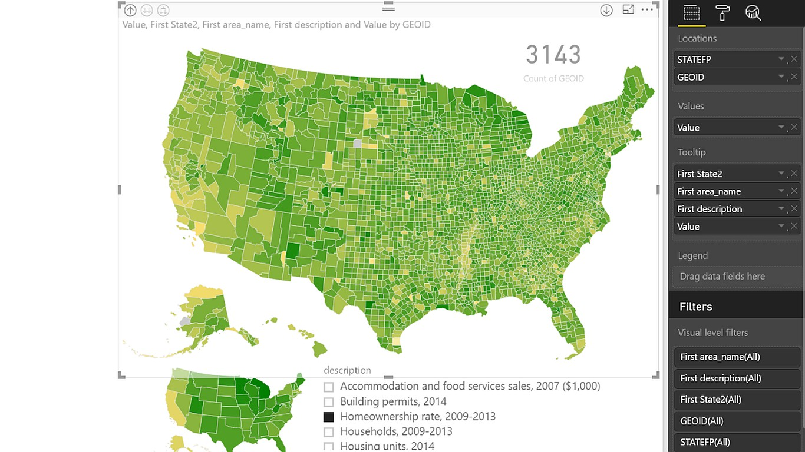

# Drilldown choropleth

> Displays a hierarchical map set with each location filled in a color from specified values

# Overview

With the Drilldown Choropleth and Drilldown Cartogram visuals, you can explore deep geographic data, plotting hundreds or even thousands of items (all US counties at once, all the precincts in a county, etc.) and then drilling down their data hierarchy (like from state, to county, to precinct). These controls were designed specifically to help large and small political campaigns explore and draw insights from their data – but they’re useful for other audiences, too.

To use the visuals, bring a dataset into Power BI, and put the custom visual on your page. 

There are two map types as part of this set: 
- The Drilldown Choropleth displays each location on a map filled with a color based on the value for each location.
- The Drilldown Cartogram displays a circle for each location, with the size and color based on the values you specify

Put your data’s first-level location property in the Locations field, and the property you want to chart in the Values fields.

Then on the visual’s Formatting pane, open the Shape customization and put the URL to the first level of your map in the Level 1 box, the URL to your next level in the Level 2 box, and so on. If the name of the geographic property of your map doesn’t match the name of the field in your data, you can set that property name in the ID boxes.

You can alternately set a Legend property to control the color of each area on the map; this is useful to reflect things like which candidate or party had the most votes in an area.

Note that you’ll need to put your topojson-formatted maps on a web server; the Tips page of the sample reports have guidance about how to do that.

This visual was built in conjunction with our partner [Gramener](http://gramener.com).

# Contributing

This project has adopted the [Microsoft Open Source Code of Conduct](https://opensource.microsoft.com/codeofconduct/). For more information see the [Code of Conduct FAQ](https://opensource.microsoft.com/codeofconduct/faq/) or contact [opencode@microsoft.com](mailto:opencode@microsoft.com) with any additional questions or comments.
